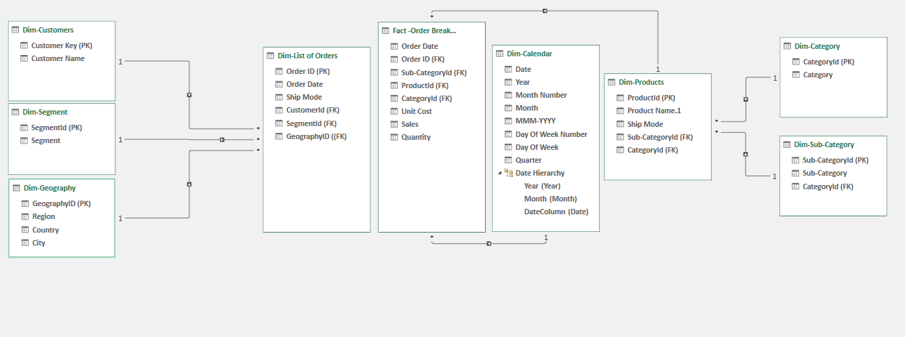

# Analysis Project

## Description
This project leverages Excel and Power Query to clean, transform, and analyze data, then visualize insights through various plots. It involves:
- Importing and transforming raw data using Power Query.
- Cleaning, filtering, and aggregating the dataset.
- Creating interactive dashboards and charts to showcase key findings.

## Files
- **Data.xlsx:** Original data source.
- **Analysis.xlsx:** Main workbook with Power Query steps and visualizations.
- **Documentation.pdf:** Supplementary notes and assumptions.

## Images
**Data Model Scheme**  

**Visualizations**  

